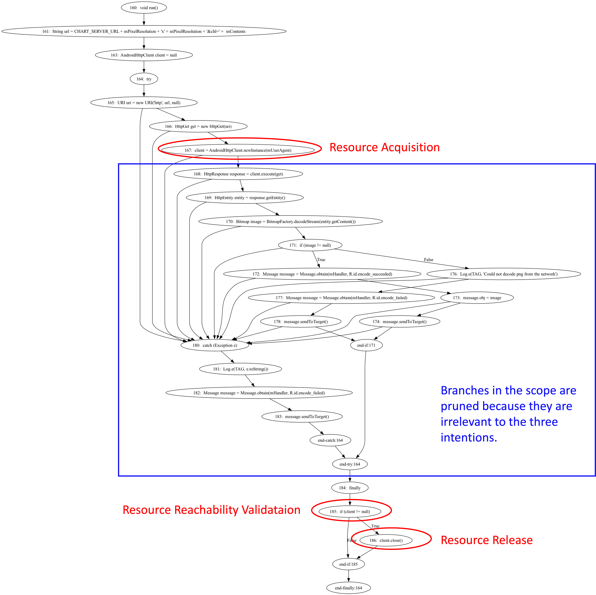
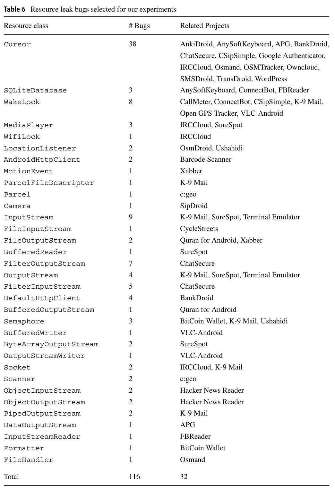
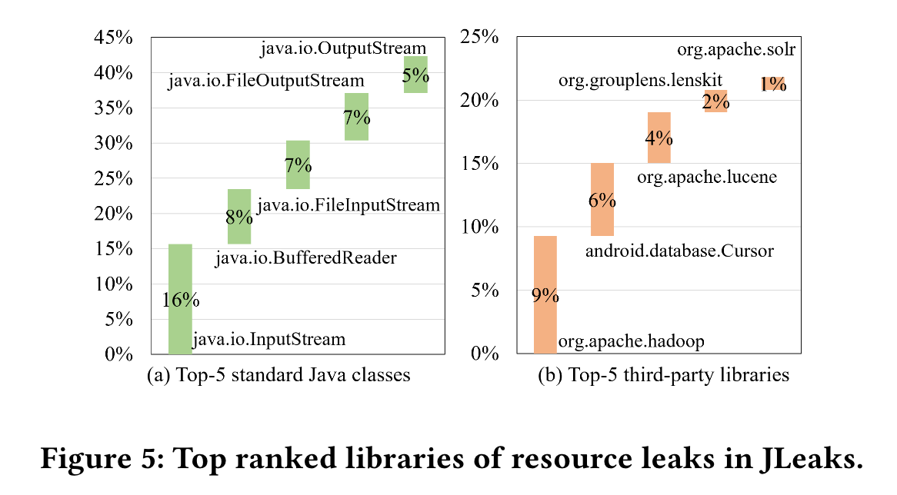
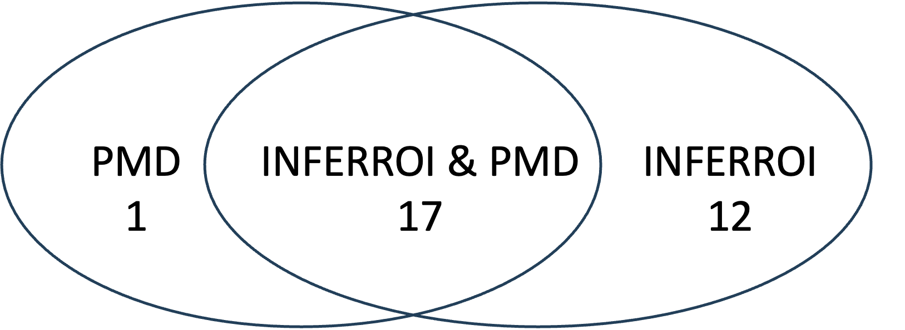
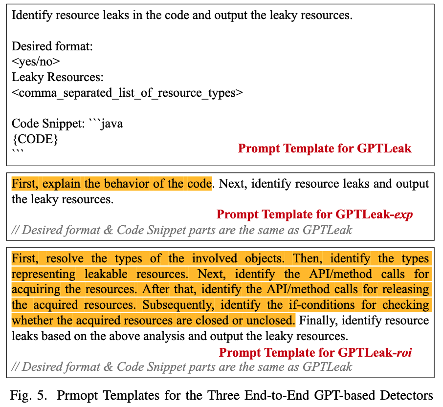

# Replication Package of *InferROI*
This replication package include all the evaluation data and results in our work, and source code will be released upon the accpetance.

## Environment
- python >= 3.9
- dependencies: `openai`, `langchain`, `spacy`, `srctoolkit`, `torch`, `transformers`

## Source Code
Source files can be found in the folders named `app`.
- `llms.py`: Define classes for different LLMs, including ChatGPT-series LLMs, Llama-3, and Gemma-2.
- `prompts.py`: Define different prompt variants used in our experiments.
- `llm4leak.py`: Define the main `LLM4Leak` class.
- `cfg.py`: Define the `CFG` class.

## CFG Example
The following figure presents the CFG correpsonding to the Fixed Version in Figure 1 in our paper.

## Evaluation

### Configuration
- LLM Version Configuration
  - `gpt-4`: gpt-4-0613
  - `gpt-4-turbo`: gpt-4-turbo-2024-04-09
  - `Llama-3-8B`: [Meta-Llama-3-8B-Instruct](https://huggingface.co/meta-llama/Meta-Llama-3-8B-Instruct)
  - `Gemma-2-9B`: [gemma-2-9b-it](https://huggingface.co/google/gemma-2-9b-it)
- LLM Parameter Configuration
  - `temperature = 0` for avoiding randomness.
  - `max_tokens = 1024` for limiting the numbers of generated tokens

### Data
Download datasets using this figshare [link](https://figshare.com/s/6b5623b4d2a18cf1e66e). Unzip the `data.zip` file, which includes the DroidLeaks dataset, JLeaks dataset, the 100 suspicious methods, and the 100 Apache Lucene methods. The statistics of resource distribution in two datasets are excerpted from their papers as follow.

### Scripts
The scripts used to evaluate InferROI are included in the `script` folder.
- `script/scan_droidleaks.py`: Detect resource leaks for the DroidLeaks dataset
- `script/scan_jleaks.py`: Detect resource leaks for the JLeaks dataset
- `script/scan_suspicious_100.py`: Detect resource leaks for the 100 suspicious methods
- `script/scan_lucene_100.py`: Detect resource leaks for the 100 Apache Lucene methods

### Results
- **RQ1:** The detection results for the DroidLeaks and JLeaks datasets can be found in [`results/rq1/droidleaks.log`](./results/rq1/droidleaks.log) and [`results/rq1/jleaks.log`](./results/rq1/jleaks.log). The detailed execution information of key steps is also included in the log files.

- **RQ2:**
  - The detection results for the 100 suspicious open-source methods can be found in [`results/rq2/suspicious-100.log`](./results/rq2/suspicious-100.log). 
  - the detection results for the 100 method sampled from Apache Lucene can be found in [`results/rq2/lucene-100.log`](./results/rq2/lucene-100.log). 
  - We submitted 12 pull requests, and 7 of them are confirmed by developers. The pull requests can be found in [`results/rq2/PR.md`](./results/rq2/PR.md).

The following Venn Diagram shows the overlap among INFERROI-detected 29 bugs and PMD-detected 18 bugs.

- **RQ3:** The prompts used in the ablation study are shown in Figure 5 below. The results of GPTLeak, GPTLeak-*exp*, and GPTLeak-*roi* on DroidLeaks can be found in [`results/rq3/droidleaks-gptleak.log`](./results/rq3/droidleaks-gptleak.log), [`results/rq3/droidleaks-gptleak-exp.log`](./results/rq3/droidleaks-gptleak-exp.log), and [`results/rq3/droidleaks-gptleak-roi.log`](./results/rq3/droidleaks-gptleak-roi.log).

- **RQ4:** The results of Llama-3-8B and Gemma-2-9B on DroidLeaks can be found in [`results/rq4/droidleaks-llama-3-8b.log`](./results/rq4/droidleaks-llama-3-8b.log) and [`results/rq4/droidleaks-gemma-2-9b.log`](./results/rq4/droidleaks-gemma-2-9b.log).

- **RQ5:** The results of the intention inference can be found in [`results/rq5/intentions.csv`](./results/rq5/intentions.csv).
